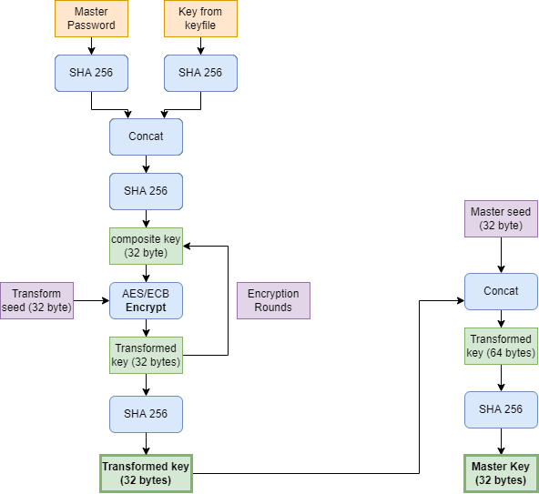
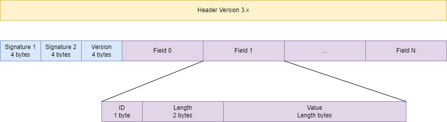

# Keepass decryption
## Introduction
I use [KeePass](https://keepass.info/) for some time now for storing my credentials and wondered: how secure is this software? Keepass stores the credentials in a .kdbx database file.

This small, quick and dirty Java application demostrates the methods KeePass uses to encrypt and decrypt your credentials. It is meant to study the security of KeePass. [This excellent site](https://gist.github.com/lgg/e6ccc6e212d18dd2ecd8a8c116fb1e45) was used as starting point and studying of the [source code of Keepass on github](https://github.com/dlech/KeePass2.x/tree/VS2022/KeePassLib/Cryptography).

The program shows the decrypted content of a small, enclosed Keepass database, which is an XML file.

In the XML file the password fields are encrypted at a second level. The software extracts the entries and show the title, username and decrypted password.

Then it tries to brute force the test_3charspassword.kdbx database using a quick and dirty and certainly inefficient algorithm.

This applies to version 3.1 of the .kdbx format. 
Out of scope:
* .kdb files (older format)
* [.kdbx 4.0](https://keepass.info/help/kb/kdbx_4.html)


## Test databases
Three KeePass testdatabases for testing are enclosed:
* test_8charspassword.kdbx, password 'testtest'
* test_4charspassword.kdbx, password 'test'
* test_3charspassword.kdbx, password 'tst'

Of course you can open them in KeePass.

A database file consists of a header and a payload. The header defines the parameters used for decryption, the payload is the encrypted and wrapped up XML database containing your credentials.

## Processing the database
Keepass executes following steps to decrypt the Password database:
1. Generate the **master key** from the passwords or keys entered by the user.
1. **Decrypt** the file content
1. Convert **blocks** to payload
1. **Decompress** the payload

Refer to [this site](https://gist.github.com/lgg/e6ccc6e212d18dd2ecd8a8c116fb1e45) for a full description or refer to the code of this project.


Steps can be seen in ```KeepassDatabase``` class, ```decryptDatabase()```
```
    public String decryptDatabase(String password)
    {
        boolean valid;
        
        xmlDatabase=null;
        valid=generateKey(password);
        if (valid)
        {
            valid=decryptDatabase();
            if (valid)
            {
                valid=deblockify();
                if (valid)
                {
                    if (compressionFlags==0x01)
                    {
                        unzippedDatabase=decompress(zippedDatabase);
                    }
                    else
                    {
                        unzippedDatabase=zippedDatabase;
                    }
                    xmlDatabase=new String(unzippedDatabase);
                }
            }
        }
        return xmlDatabase;
    }
```

### Generate master key
Based on the key or password entered by the user a **master key** for (symmetric) decryption is generated by a fairly complex process. It encompasses a variable number (60.000 for KeePass, 6.000 for Keeweb) of AES encryption loops, multiple SHA256 hashing, salting.
The only advantage I see, that it takes some time to execute this generation which makes brute forcing more difficult. Salting with a salt that is enclosed in the database itself isn't much of use I believe. Is seems merely *security-by-obscurity*.



Note that if the Key from keyfile is not present, only the Master Password is processed.

Using the brute force method enclosed it takes 3 minutes to brute force a 3 character password 'tst' on a Core I5 2.4 GHz. This time rapidly increases with the number of characters.

### Decrypting the file
This is done using AES/CBC/PKCS5Padding, which is a sensible method and best practice. It requires the generated key and an initialisation vector which is in the header of the .kdbx file.

### Convert blocks to payload
The decrypted file consists of numbered blocks with a SHA256 hash. Blocks have to be unwrapped, hash validated and glued together to get the GZIP compressed content.
Note that the blocks are precededed with a string of 32 random bytes that are also present in the header. Using this sequence you can validate that decryption has succeeded.

### Decompress the payload
To get to the XML one optional step remains: unzipping the payload.

## Decrypting a password
A password within the XML is decrypted as follows
1. The 'Random Stream ID' defines the algorithm used: Salsa20 or RC4
1. Take the SHA256 of the Password Encryption Key enclosed in the database
1. Base64 decode the password from the XML
1. Use Salsa20 or RC4 to decrypt, using the key and a fixed Initialisation Vector E830094B97205D2A

## Header
The Header in the .kdbx file contains the information that is needed together with the master password or key file to decrypt the database.



The header consists of two signatures, a version and a number of fields.
* Signature 1: 0x9aa2d903
* Signature 2: 0xb54bfb67

The version is 0x00030001 for version KDBX 3.1 and 0x00040000 for KDBX 4.0.

Fields consist of an identification, a value length (big endian) and a value. Following fields are seen:
* 0: end of header; value is 4 bytes 0x0d0a0d0a
* 1: unclear; the entire field is 4 bytes, length does not make sense.
* 2: Cipher UUID; 0x31c1f2e6bf714350be5805216afc5aff for AES
* 3: Compression flags: 1 - GZIP compression
* 4: Master seed
* 5: Transform seed
* 6: Transform rounds
* 7: Encryption initialisation vector (IV)
* 8: Password encryption key, used for 2nd round of password encryption
* 9: Stream start bytes, first 32 (random) bytes of unencrypted content.
* 10: Password cipher: 0 - none, 1 - RC4, 2 - Salsa20

## Results
It first shows the header fields, defining the 
```
2023-01-15 07:47:33 INFO Header Signature 1   : 9aa2d903
2023-01-15 07:47:33 INFO Header Signature 2   : b54bfb67
2023-01-15 07:47:33 INFO 2 Cipher UUID        : 31c1f2e6bf714350be5805216afc5aff
2023-01-15 07:47:33 INFO 3 Compression flags  : 1
2023-01-15 07:47:33 INFO 4 Master Seed        : 3beafb2ea5d451f2d2fad3b9956420e540bce9b9d7091c25d292702bf0d5202b
2023-01-15 07:47:33 INFO 5 Transform Seed     : 45028183645ca4f6a83eafcb645e3681aa936806d94ddab03768da08d6d17b01
2023-01-15 07:47:33 INFO 6 Transform rounds   : 60000
2023-01-15 07:47:33 INFO 7 Encryption IV      : 2c2c74b6794b267ae94b32a26af3661d
2023-01-15 07:47:33 INFO 8 Password Encr. key : 6b25c9d70e5c19ac5174d77453ad23701527562e02b8ec5cac892dc3e4b51c12
2023-01-15 07:47:33 INFO 9 Stream start bytes : 5599f845b9d82287d07a6d045c194e533abff631a25b581dfe9d7b9969f296af
2023-01-15 07:47:33 INFO A Random Stream ID   : 2
2023-01-15 07:47:33 INFO 0 End of header      : 0d0a0d0a
```

And finally the XML database:
```
<?xml version="1.0" encoding="utf-8" standalone="yes"?>
<KeePassFile>
	<Meta>
		<Generator>KeePass</Generator>
		<HeaderHash>LY+cn246QYs/dm/sUjFSS6WbJZgcEMJMDJL6ad7G0Fs=</HeaderHash>
		<DatabaseName>Test</DatabaseName>
		<DatabaseNameChanged>2023-01-14T08:12:58Z</DatabaseNameChanged>
		<DatabaseDescription></DatabaseDescription>
		<DatabaseDescriptionChanged>2023-01-14T08:12:50Z</DatabaseDescriptionChanged>
		<DefaultUserName></DefaultUserName>
		<DefaultUserNameChanged>2023-01-14T08:12:50Z</DefaultUserNameChanged>
		<MaintenanceHistoryDays>365</MaintenanceHistoryDays>
		<Color></Color>
		<MasterKeyChanged>2023-01-14T08:12:50Z</MasterKeyChanged>
		<MasterKeyChangeRec>-1</MasterKeyChangeRec>
		<MasterKeyChangeForce>-1</MasterKeyChangeForce>
		<MemoryProtection>
			<ProtectTitle>False</ProtectTitle>
			<ProtectUserName>False</ProtectUserName>
			<ProtectPassword>True</ProtectPassword>
			<ProtectURL>False</ProtectURL>
			<ProtectNotes>False</ProtectNotes>
		</MemoryProtection>
		<RecycleBinEnabled>True</RecycleBinEnabled>
		<RecycleBinUUID>AAAAAAAAAAAAAAAAAAAAAA==</RecycleBinUUID>
		<RecycleBinChanged>2023-01-14T08:12:50Z</RecycleBinChanged>
		<EntryTemplatesGroup>AAAAAAAAAAAAAAAAAAAAAA==</EntryTemplatesGroup>
		<EntryTemplatesGroupChanged>2023-01-14T08:12:50Z</EntryTemplatesGroupChanged>
		<HistoryMaxItems>10</HistoryMaxItems>
		<HistoryMaxSize>6291456</HistoryMaxSize>
		<LastSelectedGroup>nMY8B4LurUGZcF7HHGlwwg==</LastSelectedGroup>
		<LastTopVisibleGroup>nMY8B4LurUGZcF7HHGlwwg==</LastTopVisibleGroup>
		<Binaries />
		<CustomData />
	</Meta>
	<Root>
    ...
    </Root>
</Keepassfile>

```
The credentials
```
2023-01-18 21:17:52 INFO Credential for entry 'Sample Entry': username 'User Name' password 'Password'
2023-01-18 21:17:52 INFO Credential for entry 'Demo': username 'test' password 'test12345#'
2023-01-18 21:17:52 INFO Credential for entry 'Sample Entry #2': username 'Michael321' password '12345'
```

Brute force results:

```
...
2023-01-18 21:20:58 INFO Testing tsq
2023-01-18 21:20:58 ERROR Error decrypting database: Bad Padding: Given final block not properly padded. Such issues can arise if a bad key is used during decryption.
2023-01-18 21:20:58 INFO Testing tsr
2023-01-18 21:20:58 ERROR Error decrypting database: Bad Padding: Given final block not properly padded. Such issues can arise if a bad key is used during decryption.
2023-01-18 21:20:58 INFO Testing tss
2023-01-18 21:20:58 ERROR Error decrypting database: Bad Padding: Given final block not properly padded. Such issues can arise if a bad key is used during decryption.
2023-01-18 21:20:58 INFO Testing tst
2023-01-18 21:20:58 INFO Password found: tst
2023-01-18 21:20:58 INFO It took 185 seconds
``` 

## Disclaimer
The software is not meant as a fully functional KeePass replacement. It is meant for studying the security of KeePass databases.
Software has only be tested with enclosed database examples.