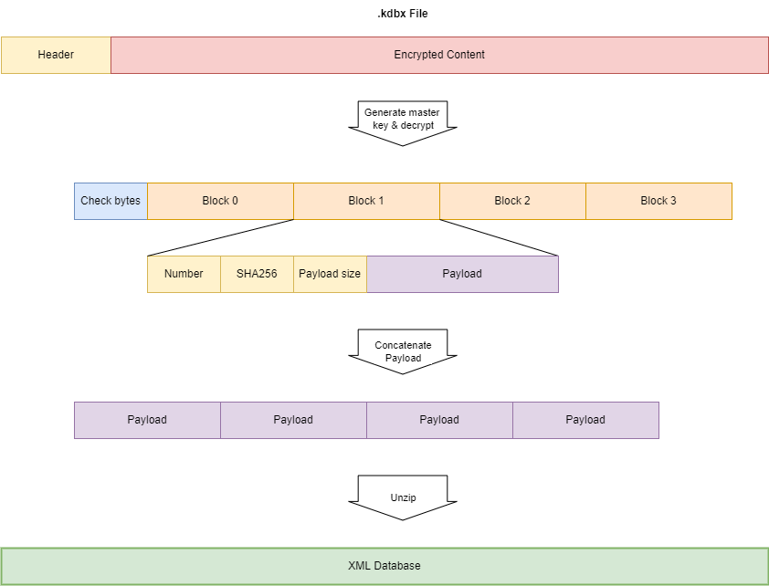

# Keepass decryption
## Introduction
I use [KeePass](https://keepass.info/) for some time now for storing my credentials and wondered: how secure is this software? Keepass stores the credentials in a .kdbx database file.

This small, quick and dirty Java application demostrates the methods KeePass uses to encrypt and decrypt your credentials. It is meant to study the security of KeePass. [This excellent site](https://gist.github.com/lgg/e6ccc6e212d18dd2ecd8a8c116fb1e45) was used as starting point and studying of the [source code of Keepass on github](https://github.com/dlech/KeePass2.x/tree/VS2022/KeePassLib/Cryptography).

The program shows the decrypted content of a small, enclosed Keepass databases (kdbx 3 as well as kdbx 4), which is an XML file.

In the XML file the password fields are encrypted at a second level. The software extracts the entries and show the title, username and decrypted password.

Then it tries to brute force the test_3charspassword.kdbx database using a quick and dirty and certainly inefficient algorithm (if you are interested, use John the Ripper).

This software applies to version .kdbx 3.1 and * [.kdbx 4.0](https://keepass.info/help/kb/kdbx_4.html)  formats. The .kdbx 4 format differs from the .kdbx 3.x format. For testing of various used protocols, refer to to the unit tests.

Out of scope:
* .kdb files (older format)
* XML parsing (the software is purely meant to show the decryption process)
* Encryption

## Test databases
Three KeePass testdatabases for testing are enclosed:
* test_8charspassword.kdbx, password 'testtest'
* test_4charspassword.kdbx, password 'test'
* test_3charspassword.kdbx, password 'tst'
* test_chacha.kdbx, password 'test'
* test_chacha_argon2id.kdbx, password 'test'

In the test resources you'll find more examples.

Of course you can open them in KeePass.

A database file consists of a **header** and a **payload**. The header defines the parameters used for decryption, the payload is the encrypted and wrapped up XML database containing your credentials.

## Processing the kdbx 3.x database
A KDBX database file consists of a **header** and a **payload**. The header defines the parameters used for decryption, the payload is the encrypted and wrapped up XML database containing your credentials.

Keepass executes following steps to decrypt the Password database 3.x:
1. Generate the **master key** from the passwords or keys entered by the user.
1. **Decrypt** the file content. This results in (decrypted) content in the form of blocks.
1. Validate the hash of the **blocks** and merge them to payload
1. Optionally: **Decompress** the payload

Refer to [this site](https://gist.github.com/lgg/e6ccc6e212d18dd2ecd8a8c116fb1e45) for a full description or refer to the code of this project.



Steps can be seen in ```DatabaseDecrypter3``` class, ```decryptDatabase()```
```
    public String decryptDatabase(String password)
    {
        boolean valid;
        
        xmlDatabase=null;
        valid=generateMasterKey(password);
        if (valid)
        {
            valid=decryptPayload(filePayload);
            if (valid)
            {
                valid=validateDecryption();
                if (valid)
                {
                    valid=deblockify();
                    if (valid)
                    {
                        if (header.getCompressionFlags()==0x01)
                        {
                            unzippedDatabase=Toolbox.decompress(zippedDatabase);
                        }
                        else
                        {
                            unzippedDatabase=zippedDatabase;
                        }
                        xmlDatabase=new String(unzippedDatabase);
                    }
                }
            }
        }
        return xmlDatabase;
    
```

### Generate master key
Based on the key or password entered by the user a **master key** for (symmetric) decryption is generated by a fairly complex process. It encompasses a variable number (60.000 for KeePass, 6.000 for Keeweb) of AES encryption loops, multiple SHA256 hashing, salting.
The only advantage I see, that it takes some time to execute this generation which makes brute forcing more difficult. Salting with a salt that is enclosed in the database itself isn't much of use I believe. Is seems merely *security-by-obscurity*.


Note that if the Key from keyfile is not present, only the Master Password is processed. This software only assumes a password.

Using the brute force method enclosed it takes 3 minutes to brute force a 3 character password 'tst' on a Core I5 2.4 GHz. This time rapidly increases with the number of characters.

### Decrypting the file
This is done using AES/CBC/PKCS5Padding, which is a sensible method and best practice. It requires the generated key and an initialisation vector which is in the header of the .kdbx file.

### Convert blocks to payload
The decrypted file consists of numbered blocks with a SHA256 hash. Blocks have to be unwrapped, hash validated and glued together to get the GZIP compressed content.
Note that the blocks are precededed with a string of 32 random bytes (check bytes) that are also present (unencrypted) in the header. Using this sequence you can validate that decryption has succeeded by comparing these bytes to the bytes in the header.

### Decompress the payload
To get to the XML one optional step remains: unzipping the payload.

## Processing the kdbx 4.x database
Keepass executes following steps to decrypt the Password database 4.x:
1. Generate the **master key** from the passwords or keys entered by the user.
1. Validate the hash of the **blocks** and merge to payload
1. **Decrypt** the payload
1. Optionally: **Decompress** the payload


or in code (```DatabaseDecrypter4``` class)
```
    public String decryptDatabase(String password)
    {
        boolean valid;
        
        generateMasterKey(password);
        generateHmacBaseKey();
        valid=validateHeaderHmacHash();
        if (valid)
        {
            valid=deblockify();
            if (valid)
            {
                valid=decryptPayload(encryptedPayload);
                if (valid)
                {
                    processDecryptedPayload();
                }
            }
        }
        return this.xmlDatabase;
    }
```

The header has basically the same format as the 3.x KDBX, however a field has been added containing a encoded KDF variant library, which contains paramaeters for the key generation.

### Generating the master key
Basically the same as for KDBX 3.1, however more *Key Derivation Functions* (KDFs) or 'transform' functinos have been added: [Argon2d and Argon2id](https://en.wikipedia.org/wiki/Argon2) encryption methods next to the AES. These algorithms have been designed to better withstand brute force attacks, because they require significant resources (memory) from the system. In the header a new field (11) has been added containing the parameters for these KDFs in a 'variant dictionary'. 


### Validate the header and block hashes
The SHA256 hash of the header can simply be calculated and verified by calculating the SHA256 hash of the header (all preceding the SHA256 hash).

The HMAC SHA256 hash of the header and blocks takes some more processing

1. The HMAC base key is calculated based on the transformed key
1. The HMAC key to use for HMAC SHA256 is derived from this HMAC base key by concatenating it to an index value and taking the SHA512. For the header it is 0xFFFFFFFF, for the block it is the block index (first block has index 0, the next 1, etc)
1. The HMAC SHA256 is calculated over the header/block bytes using the HMAC key.

The process is depicted below.


### Validate and merge blocks
In KDBX 4 the blocks contain encrypted payload. The HMAC SHA256 hash of the blocks can be validated prior to decryption.

## Decrypting a password
A password within the XML is decrypted as follows
1. The 'Random Stream ID' defines the algorithm used: Salsa20 or RC4
1. Take the SHA256 of the Password Encryption Key enclosed in the database
1. Base64 decode the password from the XML
1. Use Salsa20 or RC4 to decrypt, using the key and a fixed Initialisation Vector E830094B97205D2A

## Header
The Header in the .kdbx file contains the information that is needed together with the master password or key file to decrypt the database.


The header consists of two signatures, a version and a number of fields.
* Signature 1: 0x9aa2d903
* Signature 2: 0xb54bfb67

The version is 0x00030001 for version KDBX 3.1 and 0x00040000 for KDBX 4.0 (hence the version consists of 2 byte major and 2 byte minor version).

Fields consist of an identification, a value length (big endian) and a value. Following fields are seen:
* 0: end of header; value is 4 bytes 0x0d0a0d0a
* 1: unclear; the entire field is 4 bytes, length does not make sense.
* 2: Cipher UUID; 0x31c1f2e6bf714350be5805216afc5aff for AES
* 3: Compression flags: 1 - GZIP compression
* 4: Master seed
* 5: Transform seed - obsolete in .KDBX 4, replaced by Variant Library
* 6: Transform rounds - obsolete in .KDBX 4, replaced by Variant Library
* 7: Encryption initialisation vector (IV)
* 8: Password encryption key, used for 2nd round of password encryption
* 9: Stream start bytes, first 32 (random) bytes of unencrypted content.
* 10: Password cipher: 0 - none, 1 - RC4, 2 - Salsa20
* 11: Encoded KDF variant library (.KDBX 4)

In KDBX 4 the header is followed by
* SHA256 of the header
* HMAC SHA256 of the header

The first can be validated by simply calculating the SHA256 hash of the header.
For the latter it is required that based on password and/or keyfile the master key is generated. The intermediate transformed key is used as key for calculating the HMAC SHA256 hash.


When brute forcing this HMAC SHA256 of the header can be used to validate the password.

## Results
It first shows the header fields, defining the decryption. For version 3:
```
2023-01-29 20:13:39 INFO Header Signature 1   : 9aa2d903
2023-01-29 20:13:39 INFO Header Signature 2   : b54bfb67
2023-01-29 20:13:39 INFO KDBX Version         : 3.1
2023-01-29 20:13:39 INFO 2 Cipher UUID        : 31c1f2e6bf714350be5805216afc5aff
2023-01-29 20:13:39 INFO 3 Compression flags  : 1
2023-01-29 20:13:39 INFO 4 Master Seed        : 580eb0ec652b3960f20bab8f423b4518d9a52522019545969ace411400ad34d2
2023-01-29 20:13:39 INFO 5 Transform Seed     : 59bd2b8f15104441b35d00ee557a28a0652d0c86a130635baca2d3f41335bb50
2023-01-29 20:13:39 INFO 6 Transform rounds   : 60000
2023-01-29 20:13:39 INFO 7 Encryption IV      : aabd203f8eac9d46e0669a4eadcdef57
2023-01-29 20:13:39 INFO 8 Password Encr. key : c724e98b5e131a2bf982c42967fe1265581fcf1bb462bb8efaf22b3073e2c0ce
2023-01-29 20:13:39 INFO 9 Stream start bytes : 85d5e97c493e47ee127cd78805ff3082b6b16c4e457ef73de144c049ccb00720
2023-01-29 20:13:39 INFO A Random Stream ID   : SALSA20
2023-01-29 20:13:39 INFO B KDF parameters     : -
2023-01-29 20:13:39 INFO 0 End of header      : 0d0a0d0a
```

For version 4:
```
2023-01-29 20:24:09 INFO Header Signature 1   : 9aa2d903
2023-01-29 20:24:09 INFO Header Signature 2   : b54bfb67
2023-01-29 20:24:09 INFO KDBX Version         : 4.0
2023-01-29 20:24:09 INFO 2 Cipher UUID        : d6038a2b8b6f4cb5a524339a31dbb59a
2023-01-29 20:24:09 INFO 3 Compression flags  : 1
2023-01-29 20:24:09 INFO 4 Master Seed        : a9cc92ffb93f86a31655c9e85d5adb234f54f9ba3a8f98794ad22b711e726d57
2023-01-29 20:24:09 INFO 5 Transform Seed     : -
2023-01-29 20:24:09 INFO 6 Transform rounds   : null
2023-01-29 20:24:09 INFO 7 Encryption IV      : 097631e2f4277a20fc37a63a
2023-01-29 20:24:09 INFO 8 Password Encr. key : -
2023-01-29 20:24:09 INFO 9 Stream start bytes : -
2023-01-29 20:24:09 INFO A Random Stream ID   : null
2023-01-29 20:24:09 INFO B KDF parameters     : 00014205000000245555494410000000c9d9f39a628a4460bf740d08c18a4fea0501000000520800000060ea0000000000004201000000532000000014c7023eb53c968c1d3bca3b84db9bec2925d8b7566348ccadf01d0e5f0dc3cc00
2023-01-29 20:24:09 INFO 0 End of header      : 0d0a0d0a
2023-01-29 20:24:09 INFO KDF PARAMETERS (VERSION 4)
2023-01-29 20:24:09 INFO KDF cipher UUID      : c9d9f39a628a4460bf740d08c18a4fea
2023-01-29 20:24:09 INFO KDF Transform rounds : 60000
2023-01-29 20:24:09 INFO KDF Transform seed   : 14c7023eb53c968c1d3bca3b84db9bec2925d8b7566348ccadf01d0e5f0dc3cc
2023-01-29 20:24:09 INFO KDF Iterations       : null
2023-01-29 20:24:09 INFO KDF Parallelism      : null
2023-01-29 20:24:09 INFO KDF mem size         : null
2023-01-29 20:24:09 INFO KDF V                : null
```

And finally the XML database:
```
<?xml version="1.0" encoding="utf-8" standalone="yes"?>
<KeePassFile>
	<Meta>
		<Generator>KeePass</Generator>
		<HeaderHash>LY+cn246QYs/dm/sUjFSS6WbJZgcEMJMDJL6ad7G0Fs=</HeaderHash>
		<DatabaseName>Test</DatabaseName>
		<DatabaseNameChanged>2023-01-14T08:12:58Z</DatabaseNameChanged>
		<DatabaseDescription></DatabaseDescription>
		<DatabaseDescriptionChanged>2023-01-14T08:12:50Z</DatabaseDescriptionChanged>
		<DefaultUserName></DefaultUserName>
		<DefaultUserNameChanged>2023-01-14T08:12:50Z</DefaultUserNameChanged>
		<MaintenanceHistoryDays>365</MaintenanceHistoryDays>
		<Color></Color>
		<MasterKeyChanged>2023-01-14T08:12:50Z</MasterKeyChanged>
		<MasterKeyChangeRec>-1</MasterKeyChangeRec>
		<MasterKeyChangeForce>-1</MasterKeyChangeForce>
		<MemoryProtection>
			<ProtectTitle>False</ProtectTitle>
			<ProtectUserName>False</ProtectUserName>
			<ProtectPassword>True</ProtectPassword>
			<ProtectURL>False</ProtectURL>
			<ProtectNotes>False</ProtectNotes>
		</MemoryProtection>
		<RecycleBinEnabled>True</RecycleBinEnabled>
		<RecycleBinUUID>AAAAAAAAAAAAAAAAAAAAAA==</RecycleBinUUID>
		<RecycleBinChanged>2023-01-14T08:12:50Z</RecycleBinChanged>
		<EntryTemplatesGroup>AAAAAAAAAAAAAAAAAAAAAA==</EntryTemplatesGroup>
		<EntryTemplatesGroupChanged>2023-01-14T08:12:50Z</EntryTemplatesGroupChanged>
		<HistoryMaxItems>10</HistoryMaxItems>
		<HistoryMaxSize>6291456</HistoryMaxSize>
		<LastSelectedGroup>nMY8B4LurUGZcF7HHGlwwg==</LastSelectedGroup>
		<LastTopVisibleGroup>nMY8B4LurUGZcF7HHGlwwg==</LastTopVisibleGroup>
		<Binaries />
		<CustomData />
	</Meta>
	<Root>
    ...
    </Root>
</Keepassfile>

```
The credentials
```
2023-01-18 21:17:52 INFO Credential for entry 'Sample Entry': username 'User Name' password 'Password'
2023-01-18 21:17:52 INFO Credential for entry 'Demo': username 'test' password 'test12345#'
2023-01-18 21:17:52 INFO Credential for entry 'Sample Entry #2': username 'Michael321' password '12345'
```

Brute force results:

```
...
2023-01-18 21:20:58 INFO Testing tsq
2023-01-18 21:20:58 ERROR Error decrypting database: Bad Padding: Given final block not properly padded. Such issues can arise if a bad key is used during decryption.
2023-01-18 21:20:58 INFO Testing tsr
2023-01-18 21:20:58 ERROR Error decrypting database: Bad Padding: Given final block not properly padded. Such issues can arise if a bad key is used during decryption.
2023-01-18 21:20:58 INFO Testing tss
2023-01-18 21:20:58 ERROR Error decrypting database: Bad Padding: Given final block not properly padded. Such issues can arise if a bad key is used during decryption.
2023-01-18 21:20:58 INFO Testing tst
2023-01-18 21:20:58 INFO Password found: tst
2023-01-18 21:20:58 INFO It took 185 seconds
``` 

## Disclaimer
The software is not meant as a fully functional KeePass replacement. It is meant for studying the security of KeePass databases.
Software has only be tested with enclosed database examples.